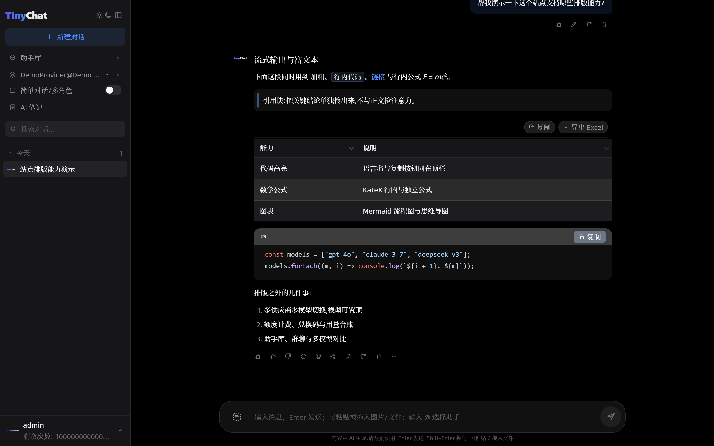
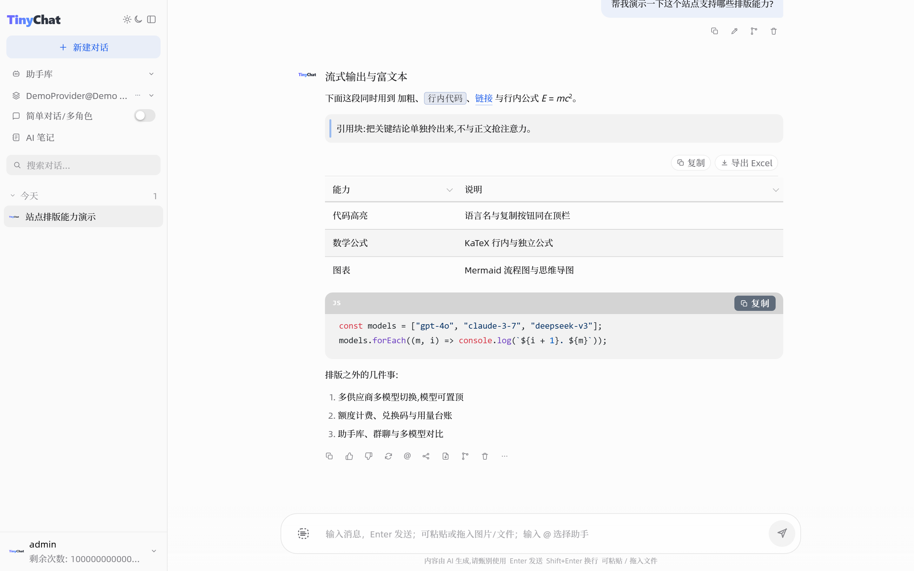
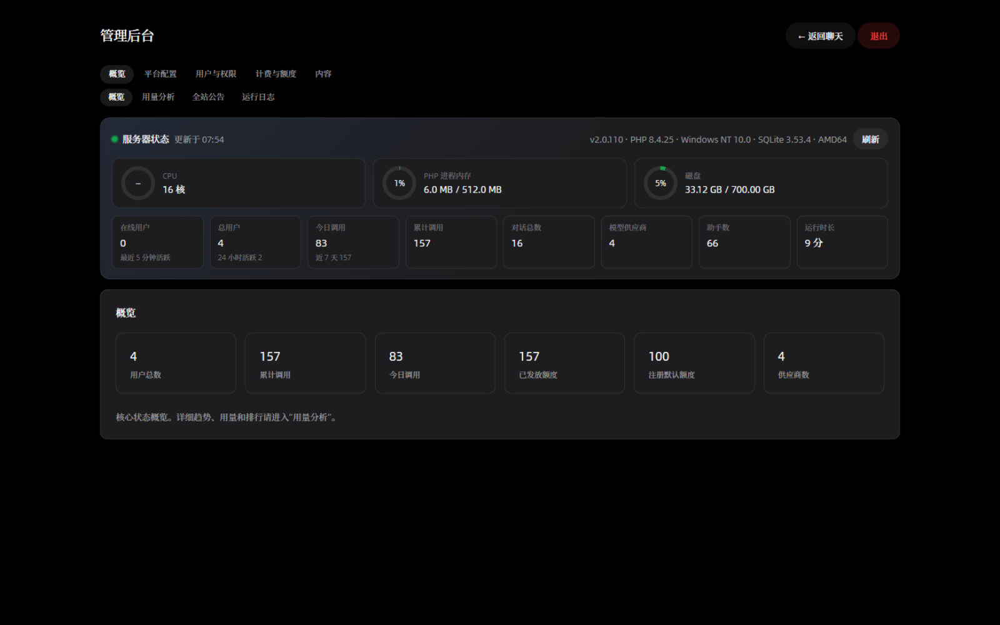

# TinyChat

**自托管的 AI 对话站点系统**：纯 PHP、无需数据库，上传虚拟主机即可运行。ChatGPT 风格界面，支持 OpenAI、Anthropic 及各类兼容接口的多模型切换，内置用户注册、额度计费、兑换码、助手库、联网搜索与在线更新——部署一次，即可让团队或朋友注册使用，所有数据都在你自己手里。

开源地址：[github.com/HCARX/TinyChat](https://github.com/HCARX/TinyChat) · License: MIT

## 🔗 Demo

- 前台：<https://demo.tinychat.us.ci/>
- 后台：<https://demo.tinychat.us.ci/admin>
- 用户名：`demo` 密码：`123456`

> Demo 站的 `demo` 账号是「演示管理员」：可以修改设置并在前台立即生效，但**改动会在 10 分钟后自动还原**，且不能修改密码。请把它当成沙盒，尽快体验。

## 🖼 界面预览

| 深色主题 | 浅色主题 |
|:---:|:---:|
|  |  |

**管理后台 · 用量分析**（近 14 天趋势、用户用量、模型评价与额度排行）：



## ✨ 功能特性

**对话体验**

- ChatGPT 风格界面：浅色 / 深色主题、可调主题色、可拖动会话栏与对话列宽度
- 流式输出、Markdown、代码高亮、KaTeX 公式、Mermaid 图表 / 思维导图
- 思维链展示与思考强度（关 / 低 / 中 / 高，含按模型规则自动修正）
- 图片与文件附件、自动追问一键发送、双击 Backspace 取消生成
- 助手库：内置 + 管理员/用户自建，@ 选择助手、可拖拽整理分类

**模型与供应商**

- 多供应商多模型：OpenAI Chat / Responses / 旧 Completions、Anthropic Messages，以及各类 OpenAI 兼容接口
- 用户可自建「个人供应商」，不出现在管理后台；API Key 以 AES-256-GCM 加密落库并与属主绑定
- 置顶模型（新建对话默认使用）、模型健康度展示
- 联网搜索：Tavily 或自建 SearXNG，输入框旁一键开关，回复附来源链接
- 文档解析：PDF / 图片 / Word / PPT / Excel（接 MinerU），链接读取自动抓取正文

**用户与运营**

- 用户注册登录、邮箱验证、找回密码（内置 SMTP 邮件与模板编辑器）
- 按次计费：额度套餐、兑换码（批量生成 / 导出 / 固定码 / 限领次数 / 有效期）
- 按量计费可选：供应商可切换为「按 token」模式（每 1K token 价格，含输入+输出，用量缺失自动回退按次）
- 用户组与模型授权：组 → 供应商 → 模型粒度控制
- 管理后台：统计看板、14 天趋势、用量台账（一键导出 CSV）、运行日志、全局设置
- 在线更新：后台一键检查并升级到 GitHub Releases 最新版
- 全站公告：后台发布，支持 Markdown / HTML 富文本，前台居中弹窗展示，用户可随时从菜单再次查看
- 注册邀请码：开启后注册必须提供有效邀请码，后台批量生成、支持一码多次有效
- **游客免登录体验**：访客直接对话，每人自动生成独立游客账号（归入「游客」组，后台可见 IP 与对话数），轮数与可用模型可配
- **演示管理员**：可自由改设置、到期自动还原，但不可改公告/账号/密码、不可查看用户对话

**安全与稳定**

- 接口限流：代理接口每用户滑动窗口限流（可配，可关闭）
- 内容审核：本地敏感词库（最多 5000 条），发送前匹配用户消息，命中即拒绝
- 用户协议：/agreement 协议页 + 注册勾选确认
- 模型熔断：连续失败的模型自动快速失败并提示换模型，事件老化后自动恢复；管理员豁免
- 自动学习：上游报错自动记录可用思考档位、自动回填模型上下文窗口
- 429/5xx 自动重试一次（未向客户端发送字节前才重试，不重复计费）
- 安全响应头：CSP、X-Frame-Options、Permissions-Policy；会话有效期可配 + 全站强制下线

**开放能力**

- OpenAI 兼容 API：/v1/chat/completions（含流式）、/v1/models 与 /v1/images/generations，用户在账户面板生成 sk-tc- 密钥（哈希落库、仅显示一次、每人最多 5 把），第三方客户端直接接入，计费与网页端一致
- 图像生成：调用供应商的 images/generations 接口（如 dall-e-3、gpt-image-1、flux、seedream），结果以 Markdown 图片插入对话；**在对话中直接选用生图模型会自动改走生图接口**，无需手动切换
- 生图模型标记：后台模型清单可显式标记「生图」，未标记时按模型名自动识别（dall-e / gpt-image / flux / seedream / imagen / qwen-image 等）
- 多模型对比：同一问题并行发给 2–3 个模型，并排查看、一键投票（计入模型评价）

**部署与数据**

- 纯 PHP（7.4+），不需要 Composer、MySQL、Node 或常驻进程；数据存于 SQLite（WAL 模式），多数虚拟主机默认支持
- 首次运行自动跑环境自检：PHP 版本、pdo_sqlite / curl / openssl 扩展、data/ 目录权限逐项核对，不通过不放行安装
- 数据备份：每日自动轮换备份整库，后台一键手动备份 / 下载 / 恢复
- 隐私模式可选：关闭后服务器不保存对话记录，对话仅存用户浏览器本地
- PWA：可「添加到主屏幕 / 安装」，静态资源离线缓存（需 HTTPS）
- Apache / Nginx / IIS 伪静态配置齐备，常见虚拟主机、宝塔面板可直接跑

## 🆚 与同类项目的定位差异

NextChat、LobeChat 等项目是「面向个人的聊天客户端」，TinyChat 的定位是「面向站长的小型 AI 站点系统」：你部署一次，其他人在你的站点上注册、消费额度、使用你配置的模型。

| | TinyChat | NextChat | LobeChat | Open WebUI |
|---|---|---|---|---|
| 运行依赖 | 仅 PHP 7.4+ | Node.js | Node.js / Docker | Docker / Python |
| 数据库 | 不需要（文件存储） | 不需要 | 建议配置 | 需要 |
| 共享虚拟主机可部署 | ✅ | ❌ | ❌ | ❌ |
| 多用户注册 / 用户组 | ✅ 内置 | — | ✅（需服务端模式） | ✅ |
| 额度计费 / 兑换码 | ✅ 内置 | ❌ | 云端版部分支持 | ❌ |
| 数据归属 | 全部在自己主机 | 浏览器本地 | 服务器 | 服务器 |

适合：想给自己/团队/朋友搭一个有账号体系、能控制额度、能插自己供应商 Key 的独立 AI 站点。
不适合：只需要一个本地单机客户端（这场景 NextChat 更轻）。

## 环境要求

- PHP 7.4+（推荐 8.x），扩展：`pdo_sqlite`（数据存储）、`curl`、`openssl`、`json`；在线更新需要 `zip` 或 `phar + zlib`
- 首次访问登录页会自动运行环境自检表单，逐项核对扩展与 `data/` 目录权限
- Apache `mod_rewrite`，或 Nginx `try_files` 转到 `index.php`
- 站点目录可写 `data/`（SQLite 库、JWT 密钥、备份都写在这里）

### 目录权限（重要）

首次访问会显示**环境自检表单**，其中「`data/` 目录可写」一项用真实写入探针验证。**即使权限不足，自检页也会正常打开**并明确标出这一项失败，页面给出修复指引而不会放行安装（此前权限不足时配置接口会直接报错，页面停在无法注册的注册页）。

推荐权限（Linux / 宝塔类面板）：

```bash
# 目录：755；宿主机 PHP 进程与文件属主一致时即可写。
# 若主机以 www / nginx 等其它用户运行 PHP，把 data/ 属主交给它，或放宽到 775：
chmod 755 data
chown -R www:www data    # 用户/组名按你的主机而定（www-data / nginx / apache）

# 仅当无法改属主时，才退而求其次放宽权限：
chmod -R 775 data
```

- 不要把整个站点目录设为 `777`，也不要给 `lib/`、`config.php` 任何写权限。
- `data/` 建议禁止外部直接访问（仓库自带的 `data/.htaccess` 已做拒绝规则；Nginx 见文末示例）。
- 权限不足时的典型现象是：能进环境自检页，但「`data/` 目录可写」一项标红，无法创建管理员。

## 快速开始

### 部署到虚拟主机

1. 把本仓库整个上传到主机网站根目录（不要只传 `public`）。
2. 确认根目录里有 `index.php`、`.htaccess`、`lib/`、`static/`、`vendor/`。
3. 按上节「目录权限」把 `data/` 设为可写（一般 `755`，PHP 进程用户不一致时 `775` 并调整属主）。
4. Apache 面板打开「伪静态 / Rewrite」。宝塔 / 主机屋一类面板选 Laravel 或 ThinkPHP 规则也行，本质是未命中静态文件就进 `index.php`。
5. 浏览器打开站点。还没有管理员时，登录页会先显示环境自检，全部通过后点「下一步：创建管理员」再创建。然后进管理后台添加全局供应商。

也可以复制 `config.sample.php` 为 `config.php`，写上 `admin_password`，首次访问会自动种下管理员（只在库里还没有管理员时生效）。

### 本机预览（已装 PHP）

```bash
php -S 127.0.0.1:8080 router.php
```

Nginx / IIS 的伪静态示例见文末「附录：服务器配置示例」。Nginx 关键两点：`try_files` 到 `index.php`，以及 `/api/proxy/` 关掉 `fastcgi_buffering` 和 gzip，否则流式输出会整段攒完才出来。

子目录部署时，把 `.htaccess` 里的 `RewriteBase /` 改成实际路径，例如 `RewriteBase /chat/`。

## 在线更新

后台「平台配置 → 版本更新」可检查并在线安装新版本：程序对比 GitHub Releases 最新 tag 与 `lib/core.php` 里的 `TC_VERSION`，有新版时下载该 tag 的源码包，解压校验后覆盖站点文件。**`data/` 与 `config.php` 不会被改动**，升级前的程序自动备份到 `data/update/backup/`（仅保留最近一次）。

自己发新版的流程：

1. 改 `lib/core.php` 里的 `TC_VERSION`（如 `'1.0.1'`），提交并推送；
2. 打同名 tag（`v1.0.1`），在 GitHub 上基于该 tag 创建 Release（Release 说明会显示在后台）。

已部署的站点进后台点「检查更新 → 一键更新」即可。主机连不上 GitHub 时，`config.php` 里可把 `github_api_base` / `github_base` 配置成镜像或加速前缀。

## 配置

复制 `config.sample.php` 为 `config.php` 按需修改，也可以用环境变量代替（环境变量优先）：

| 变量 | 说明 |
|------|------|
| `ADMIN_PASSWORD` | 首次访问时创建 / 同步管理员密码 |
| `ADMIN_NAME` | 管理员用户名，默认 `admin` |
| `JWT_SECRET` | JWT 密钥；不设则写在 `data/secret` |
| `DATA_DIR` | 数据目录，默认 `./data` |
| `CORS_ORIGIN` | 跨域来源，默认 `*` |
| `SITE_URL` | 站点对外地址（邮件链接、SEO canonical 用），不设则自动推断 |

> ⚠️ 公网部署强烈建议显式设置 `SITE_URL`：不设置时邮件里的验证 / 重置链接取自请求的 Host 头，可能被中间人伪造，诱导用户把重置令牌送到攻击者站点。

在线更新相关（一般用默认即可）：

| 变量 | 说明 |
|------|------|
| `github_repo` | 仓库，默认 `HCARX/TinyChat` |
| `github_token` | 私有仓库必填；公开仓库留空即可 |
| `github_api_base` | API 根地址，默认 `https://api.github.com`，可换镜像 |
| `github_base` | 发布包下载根地址，默认 `https://github.com`，可填 ghproxy 类加速前缀 |

## 目录

```
TinyChat/
├── index.php              # 入口：路由、页面、/api
├── router.php             # 仅本地 php -S 使用
├── robots.txt             # 搜索引擎爬虫规则
├── .htaccess              # Apache 伪静态
├── config.sample.php      # 复制为 config.php
├── lib/                   # PHP 后端
│   ├── core.php           # JSON 库、JWT、密码、锁、版本号
│   ├── api.php            # 认证 / 供应商 / 助手 / 管理端
│   ├── proxy.php          # 上游 curl 代理（含 SSE）
│   ├── updater.php        # 在线更新：检查 GitHub Releases、下载覆盖
│   ├── catalog.json       # 内置助手库
│   └── cacert.pem         # Mozilla CA，Windows / 部分虚拟主机缺证书时用
├── static/  vendor/       # 前端
├── index.html login.html admin.html share.html
└── data/                  # 运行数据（不要提交）
```

## 数据

数据存于 `data/tinychat.sqlite`（WAL 模式），`data/secret` 保存 JWT 与加密密钥。不要提交到 Git。

v1.x 的 `db.json` 会在首次访问时自动导入到 SQLite 并改名为 `db.json.imported-*` 留档，无需手工迁移。

删掉 `data/` 里的 `tinychat.sqlite` / `secret` 即清空本机数据，下次访问会重建空库。若 `config.php` 写了管理员密码且库里还没有管理员，首次访问会再创建一个。

`data/` 自带 `.htaccess` 拒绝 Web 直访（Nginx / IIS 配置示例里同样已屏蔽）；供应商 API Key 以 AES-256-GCM 加密存储，密钥与站点绑定，拿走文件也无法在其他站点解密。

## 附录：服务器配置示例

### Nginx

```nginx
server {
    listen 80;
    server_name example.com;
    root /www/wwwroot/tinychat;
    index index.php index.html;

    location / {
        try_files $uri $uri/ /index.php?$query_string;
    }

    location ~ ^/api/proxy/ {
        include fastcgi_params;
        fastcgi_pass unix:/tmp/php-cgi.sock;
        fastcgi_param SCRIPT_FILENAME $document_root/index.php;
        fastcgi_read_timeout 300;
        fastcgi_buffering off;
        gzip off;
    }

    location ~ \.php$ {
        include fastcgi_params;
        fastcgi_pass unix:/tmp/php-cgi.sock;
        fastcgi_param SCRIPT_FILENAME $document_root$fastcgi_script_name;
        fastcgi_read_timeout 300;
    }

    location ~ ^/(data|lib|config\.php) {
        deny all;
    }
}
```

把 `root` 改成站点目录，并确认 PHP-FPM 套接字路径；`/api/proxy/` 的缓冲与 gzip 必须关闭。

### IIS（web.config）

```xml
<?xml version="1.0" encoding="UTF-8"?>
<configuration>
  <system.webServer>
    <rewrite>
      <rules>
        <rule name="TinyChat" stopProcessing="true">
          <match url=".*" />
          <conditions logicalGrouping="MatchAll">
            <add input="{REQUEST_FILENAME}" matchType="IsFile" negate="true" />
            <add input="{REQUEST_FILENAME}" matchType="IsDirectory" negate="true" />
          </conditions>
          <action type="Rewrite" url="index.php" />
        </rule>
      </rules>
    </rewrite>
    <httpProtocol>
      <customHeaders>
        <add name="X-Content-Type-Options" value="nosniff" />
      </customHeaders>
    </httpProtocol>
    <security>
      <requestFiltering>
        <hiddenSegments>
          <add segment="data" />
          <add segment="lib" />
        </hiddenSegments>
      </requestFiltering>
    </security>
  </system.webServer>
</configuration>
```

把上面内容存为站点根目录的 `web.config` 即可（已包含伪静态与 `data` / `lib` 目录的访问屏蔽）。

## 许可证

MIT
